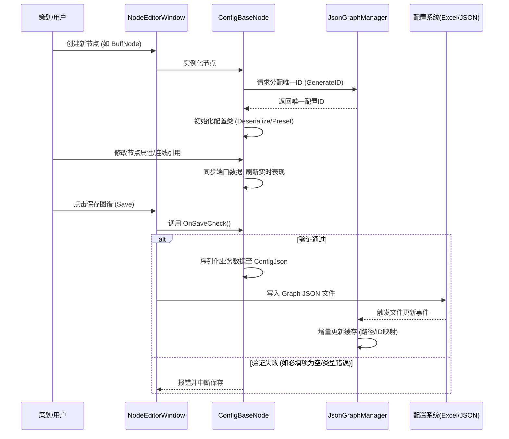

这是一份针对基于 `NodeEditor` 和 `NodeGraphProcessor` 构建的 Unity 专用的工业级技能/AI编辑器架构的详细分析报告。

## 1. 核心功能分析

### NodeGraphProcessor (底层图谱框架)
这是一个知名的开源 Unity 节点式图谱编辑框架（基于 `com.alelievr.node-graph-processor` 开发/魔改），它提供了通用的图谱基础设施：
*   **基础数据结构**：定义了 `BaseGraph`（图谱基类）、`BaseNode`（节点基类）、`NodePort`（端口）、`SerializableEdge`（连线）等核心数据模型。
*   **UI 与渲染机制**：基于 Unity 最新一代 UI 系统 `UIElements`（UIToolkit），负责节点绘制、缩放、平移、连线交互等视觉表现层。
*   **图谱逻辑执行 (Processing)**：提供如 `BaseGraphProcessor` 与 `ProcessGraphProcessor`，支持拓扑排序 (Topological Sort) 的图谱执行器，以及与 Unity Job System 的结合处理能力，用于运行时或编辑器内模拟节点间的数据流驱动。

### NodeEditor (业务编辑逻辑)
基于底层框架二次开发，专为当前项目（封神技能、AI、NPC事件、大世界交互等）设计的顶层业务编辑器：
*   **多模块统一管理**：通过 `NodeEditorManager` 统筹 `SkillEditor`（技能）、`AIEditor`（AI行为树）、`GamePlayEditor`（玩法）、`NpcEventEditor`（NPC事件）等多个垂直编辑器。
*   **数据驱动（配表与节点绑定）**：该编辑器深度耦合了 Excel 配置表。通过 `ConfigBaseNode`，节点本身代表配置表中的一行数据，节点间的连线往往代表配置表 ID 的引用关系。
*   **高阶功能封装**：包含模板节点复用 (`IsTemplate` / `TemplateParams`)、版本校验合并 (`TableTash` 机制处理 Excel 表结构变更的向下兼容)、引用追踪和全局缓存管理。

---

## 2. 架构设计

### 模块划分
*   **`NodeEditor/Base`**: 编辑器自定义的底层基类扩展（如 `GraphData`、`VirtualNodeData`），打通框架与游戏业务的桥梁。
*   **`NodeEditor/Datas`**: 数据流核心，如 `JsonGraphManager` 全局管理整个工程的 Graph Json 序列化与文件检索；`ConfigParseData` 负责与配置表映射交互。
*   **`NodeEditor/Nodes`**: 具体业务节点逻辑的集合，包含 `BaseConfig`（配表基类）、`AttributeProcessor`（特性处理器）、基于业务分类的各种自定义节点。
*   **`NodeEditor/AutoGenerate`**: 自动化代码生成的目录，利用工具从 Excel/配置 反向生成 C# 节点类，极大降低维护成本。
*   **`NodeGraphProcessor/Runtime & Editor`**: 标准的运行与编辑器界限划分，保证运行时（Runtime）不夹杂 UnityEditor API，支持最终数据脱离编辑器运行。

### 数据流与通信机制
*   **节点间通信**：在普通的运算节点中，通过 `NodePort` 和反射（或者强类型绑定）将 Output 数据传递给 Input。但在本项目中（如 `ConfigBaseNode`），更多的数据流是以 **"ID 引用"** 的形式存在的。父节点的 Output 往往是自身的 `ID`，子节点通过连线获取该 ID，并填充进自己的 `Config` 数据字段中（如 技能触发某 Buff，Buff节点把自身ID传递给技能节点的 BuffId 列表端口）。
*   **配置流转**：Excel 配置表 $\leftrightarrow$ C# 数据对象 $\leftrightarrow$ `JsonGraphManager` 解析 $\leftrightarrow$ 图谱可视化表现。编辑器修改节点数据后，最终会序列化成 JSON 字符串（保存在 `ConfigJson` 中），导出时甚至直接生成供游戏读取的二进制/Excel 数据。

---

## 3. 工业化考量

从工业化管线的角度来看，该架构设计具有极高的成熟度：
*   **极强的可扩展性 (Scalability)**：利用 `AutoGenerate` 自动生成节点类，当策划在 Excel 中新增表或新增字段时，底层通过编译宏和反射自动生成 `ConfigNode` 及端口。这意味着程序基本不需要手写枯燥的界面代码即可支持新功能。
*   **高级模板机制 (Reusability)**：通过 `TemplateNode` 设计，可以将复杂的局部图谱（如一段通用的受击打断逻辑）封装为模板。任何一处修改，其他引用的地方可实时感知和同步，解决中大型项目中配置大量冗余导致的灾难性维护问题。
*   **全局数据检索与性能优化 (Performance)**：`JsonGraphManager` 是精髓。如果每次为了找引用关系去反序列化所有 Graph 会卡死编辑器。它通过监控本地 JSON 文件变动，采用 `FileSystemWatcher` 或心跳监控，将所有 Graph 的核心信息（ID、类型、引用）在内存中做成轻量级的 Hash 缓存（写入 `Cache` 目录）。这使得庞大工程在编辑器状态下依然流畅。
*   **防呆与纠错 (Debugging/Safety)**：具备 `LogRedirection` 重定向追踪；在节点 `OnSaveCheck` 时校验参数类型与配表约束；更在保存时检查 SVN 文件冲突以及 ID 重复验证，降低多人协同的事故率。

---

## 4. Mermaid 流程图

### 4.1 节点图谱构建与数据保存流程



### 4.2 图谱逻辑执行流程 (以 NodeGraphProcessor 底层执行或运行验证为例)

```mermaid
graph TD
    A[启动图谱执行请求] --> B{解析图谱}
    B --> C[加载 JSON 数据]
    C --> D[反序列化 BaseGraph]
    D --> E[重建 Node 实例并赋予数据]
    E --> F[重连 SerializableEdge 边]
    F --> G[ProcessGraphProcessor 计算拓扑排序]
    G --> H{循环节点: 基于 ComputeOrder}
    H --> I[执行 Input 端口取值]
    I --> J[执行 Node.OnProcess() 逻辑]
    J --> K[执行 Output 端口赋值]
    K --> |仍有下一个节点|H
    K --> |结束|L[图谱执行完毕 / 数据导出完成]
```

---

## 5. 关键代码分析

### `NodeEditor.ConfigBaseNode`
作为业务配置节点的最核心基类，承载了大量的工业级设计：
*   **ID驱动**：`public int ID;`，每个节点本质是一条具有唯一 ID 的数据。`GenerateID(bool reset)` 方法接入全局 ID 分配器，防止多人协作撞号。
*   **数据兼容与恢复**：`Deserialize()` 方法中通过对比 `TableTash` (Hash值)。如果发现节点对应的 Excel 表结构变了，它会智能选择是用保存在本地图谱 JSON 里面的旧数据尽量转换，还是尝试去读取 Excel 表格本身的数据恢复 (`DesignTable.GetTableCell<T>(ID)`)，完美解决了配置结构迭代时的数据丢失问题。
*   **模板机制**：支持将一组参数提升为 `TemplateParams`（暴露出外部端口）。如果 `IsTemplate` 为真，则它自身就是一个逻辑复用的母版，`JsonGraphManager` 会立即收录。

### `NodeGraphProcessor.ProcessGraphProcessor`
这是一个轻量高效的处理器：
*   **拓扑排序**：`UpdateComputeOrder()` 根据节点的依赖关系（谁连了谁）使用内置算法计算出一个一维数组 `processList`。
*   **批处理**：`Run()` 方法只需要简单遍历该列表并调用 `processList[i].OnProcess()`，性能极高，适合高频触发的战斗技能效果解算。

### `NodeEditor.JsonGraphManager`
*   **全局缓存字典**：拥有 `Path2JsonGraphInfo`（文件路径查找）、`ConfigNameID2GraphInfos`（表名与ID的反向查找），这使得无论你身处何处，只要知道一个技能 ID，就能瞬间定位甚至打开包含它的那个 Graph 文件（`TryOpenGraphWithProgressBar`）。
*   **异步读写与脏标记**：在 `InitData()` 中为了不阻塞 Unity 主线程，缓存更新使用了 `Utils.WriteToJsonAsync` 进行异步读写，配合 `isDirty` / `isWriting` 标志位确保线程安全。

---

## 6. Jsons 文件夹机制

**数据格式与作用**：
`Jsons` 文件夹存储的是图谱的 **视觉表现 + 业务配置序列化** 的混合体。
从代码中的 `JsonGraphInfo` 类提取格式如下：
*   包含文件元数据：`Version`，`graphName`。
*   包含 `Nodes` 列表，单个节点拥有：
    *   `GUID`: 编辑器中节点的唯一视觉标识（用于画线连接）。
    *   `ID` 与 `ConfigName`: 所映射的配置表实体与对应ID。
    *   `ConfigJson`: 这是关键点。编辑器没有把所有的细碎参数直接暴露成零散的 JSON key，而是把整条业务数据（比如暴击率、伤害倍率）使用 `Newtonsoft.Json` 序列化为一个巨大的 String 存进 `ConfigJson` 里。
    *   `TemplateParams`: 模板动态参数的信息。

**工业化作用**：
1.  **所见即所得的持久化**：确保策划关闭编辑器后，所有节点的位置、连线状态以及具体填写的配置参数不会丢失。
2.  **双向同步桥梁**：它是连接 C# 配置结构体和可视化 Node界面的中介。在加载时，框架将 `ConfigJson` 反序列化为真正的 `SkillConfig` 类，赋予节点；在保存时，框架检查合法性，然后再转回 `ConfigJson`。最终，游戏业务层可能甚至不需要直接读取这个 JSON，而是通过编辑器额外的一道流程，将这批被验证合法的配置“转储”导出为纯净的 Excel 数据或二进制配置供游戏运行，分离了“编辑数据”和“运行数据”。